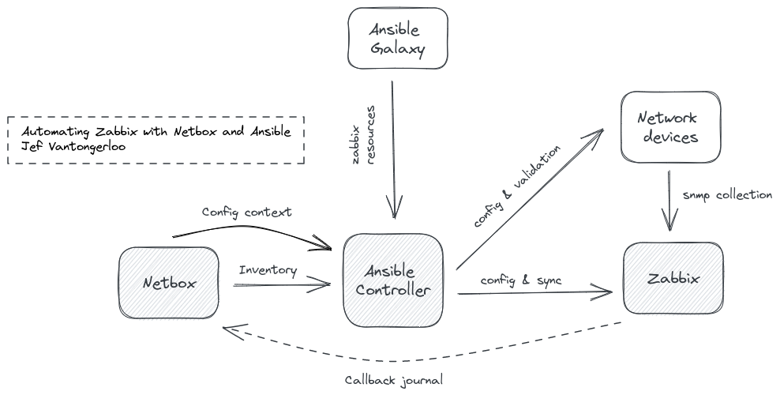

# zabbix-automation-demo

> Automating Zabbix with Netbox and Ansible

Manual tasks can be time-consuming and prone to human errors. We leverage automation to configure, import and synchronize network devices to Zabbix. Netbox acts as a source of truth for our Zabbix desired state and the device snmp configuration. Ansible orchestrates and glues all the API component interactions together for a consistent, reliable and scalable automation chain.



## Installation

Clone git repository

```shell
git clone https://github.com/jefvantongerloo/zabbix-automation-demo.git
```

Install dependencies

```shell
poetry install
poetry self add poetry-dotenv-plugin
```

Install Ansible collections

``` shell
ansible-galaxy collection install -r collections/requirements.yml
```

## Environment variables

```shell
# Ansible network related variables
# More info: https://docs.ansible.com/ansible/latest/network/getting_started/network_differences.html
ANSIBLE_USER=''
ANSIBLE_PASSWORD=''
ANSIBLE_CONNECTION=''
ANSIBLE_NETWORK_OS=''

# Netbox related variables
# More info: https://demo.netbox.dev/static/docs/rest-api/overview/
NETBOX_API=''
NETBOX_TOKEN=''

# Ansible Zabbix related variables
# More info: https://github.com/ansible-collections/community.zabbix
ZABBIX_API=''
ANSIBLE_ZABBIX_AUTH_KEY=''

# Switch snmp config related variables
CFG_SNMP_PASSPHRASE=''
```

## Getting started

1. Add Netbox device `zabbix` tag

2. Check Ansible Netbox inventory plugin

    ```shell
    ansible-playbook -i inventory/ --list
    ```

3. Run Ansible `zabbix-sync` playbook

    ```shell
    ansible-playbook -i inventory/ playbooks/sync-zabbix.yml
    ```

## Ansible tags

- switch-config
- zabbix-config
- zabbix-hosts
